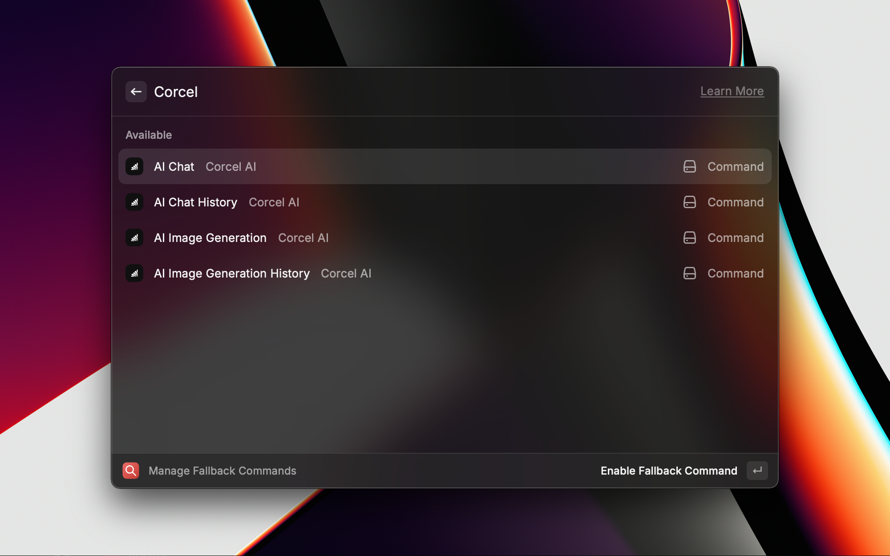
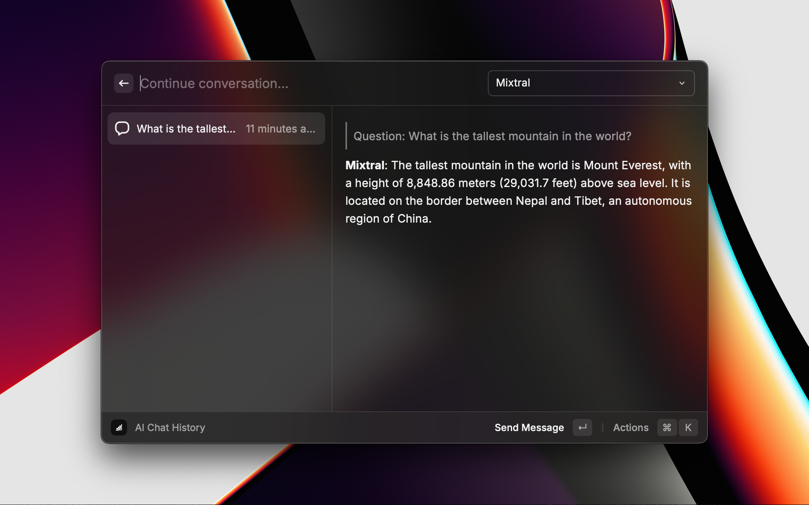
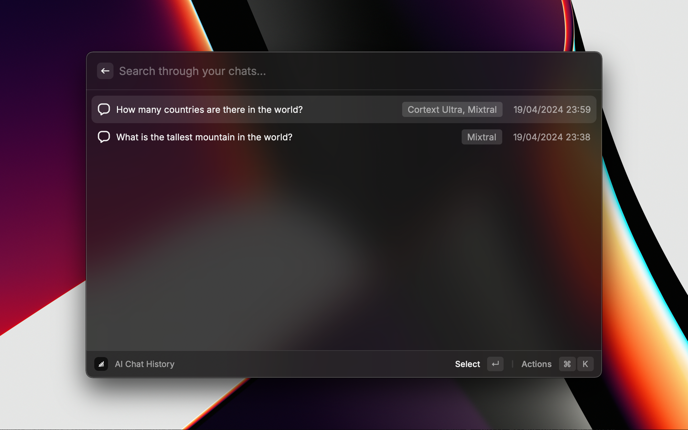
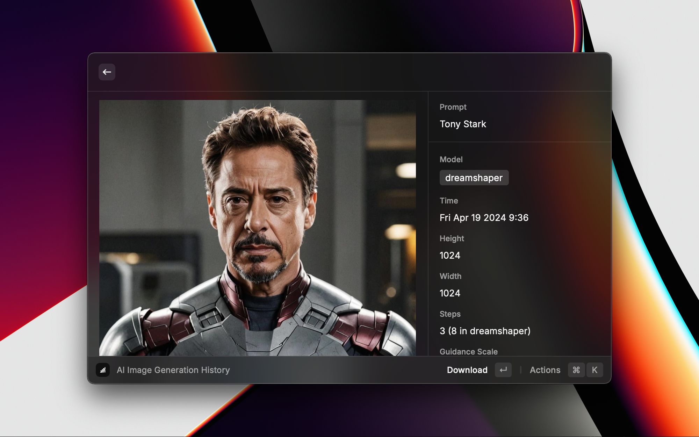

    

<h1 align="center">Corcel</h1>

<h3 align="center">
    AI Chat and Image Generation at your fingertips. 
    Use more AI powered applications on <a href="https://corcel.io">Corcel.io</a>
</h3>

## Getting Started

- Install the extension :)

- Generate an API key [here](https://app.corcel.io/dashboard/api-keys) and copy it to your clipboard

- When you open any command, you will be greeted with this screen. Paste in your API key. If you don't see this, you can always update this in the extension preferences.

- That's it! You are good to go.

## Features

### AI Chat

Chat with a variety of models hosted on the bittensor network. AI chat featues: Getting responses from different models while preserving context, a locally stored chat history, copy/paste question and answer, chat deletion etc.

### AI Image Generation

Generate, save and download images with a variety of models

## Preferences

You have customization options for chat and image generation. Some customizations are command specific while some are affect all commands in the extension.
